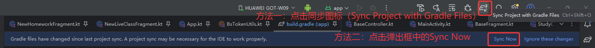
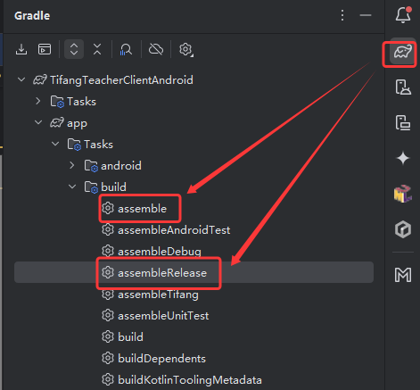
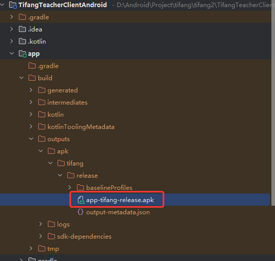

# sdk升级与打release包说明文档

## 1.sdk升级方式
1）在build.gradle中找到依赖库，如（oldVersion指旧版本号）：

```
dependencies {
    api("cn.plaso:yxtsdk:oldVersion")
}
```

如果文件格式为build.gradle.kts，方式同build.gradle：

```
dependencies {
    implementation("cn.plaso:yxtsdk:oldVersion")
}
```

2）将版本号更新。比如，将以下版本更新：

```
dependencies {
    api("cn.plaso:yxtsdk:2.0.4-student-aind")
}
```
更新为
```
dependencies {
    api("cn.plaso:yxtsdk:2.0.5-student-aind")
}
```

3）同步文件，等待库安装完毕



## 2.打release（发布）包方式

1.进入项目，依次点击右侧栏Gradle->展开图示目录->双击assemble（编译所有包）或assembleRelease（只编译release包）



2.等待apk包编译完成，路径如图：


